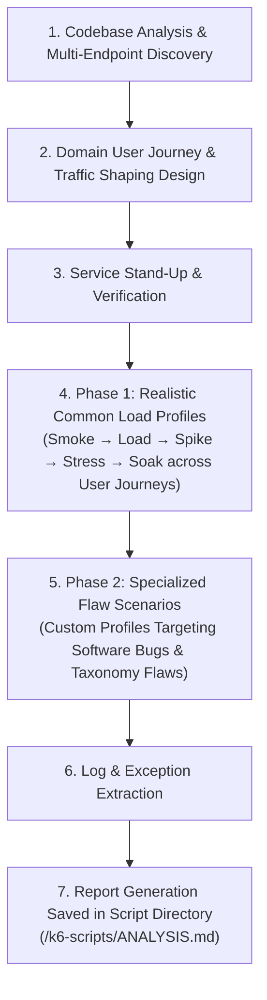

# K6 Load Tester

This skill automates performance quality assurance, realistic traffic-shaping load testing, and active structural flaw debugging for service-based applications using k6.

It follows a **deterministic, 2-phase execution strategy**:
1. **Phase 1 (Realistic Common Load Profiles)**: Analyzes codebase architecture to map key domain entry points and user journeys, then executes a structured suite of common load profiles (Smoke, Load, Spike, Stress, Soak) using k6 traffic shaping across multi-endpoint domain paths (**never hitting just a single `/health` endpoint**).
2. **Phase 2 (Specialized Code-Informed Flaw Analysis)**: Inspects source code for specific software bugs and anti-patterns matching the 16-item taxonomy, constructs custom targeted flaw scenarios layered on top of common profiles, and extracts empirical proof of uncovered vulnerabilities.

---

## Standardized Workflow

### 1. Codebase Analysis & Multi-Endpoint Discovery
- **Spring Boot / Java**: Search for `@RestController`, `@RequestMapping`, `@GetMapping`, `@PostMapping`, `@PutMapping`, `@DeleteMapping`. Inspect controllers, DTOs, entity relationships, and service methods.
- **Python / Node.js / Go**: Parse Express, Flask/FastAPI, Gin/Fiber routes and request handlers.
- **Entry Point Mapping**: Discover all key functional routes (authentication, list browsing, item detail views, searches, data creation/updates, background tasks).
- **Configuration Inspection**: Read application properties/YAML for server port (`server.port`), connection pools (`hikari.maximum-pool-size`), thread pools (`server.tomcat.threads.max`), and timeouts.

### 2. Domain User Journey & Traffic Shaping Design
Construct realistic multi-endpoint user journeys in k6 using advanced traffic shaping:
- **Weighted Request Distribution**: Combine routes dynamically within scenario functions (e.g., 50% list browsing, 25% detail view, 15% search, 10% item creation).
- **k6 Traffic Shaping Features**: Utilize k6 `scenarios`, `exec`, `ramping-vus`, `ramping-arrival-rate`, `constant-arrival-rate`, dynamic synthetic payload generation, and authentication headers (`setup()` JWT acquisition).
- **STRICT DIRECTIVE**: **NEVER restrict load tests to a single `/health` or trivial status check endpoint.** Load profiles MUST exercise realistic domain business logic paths.

### 3. Service Stand-Up & Verification
- Stand up target containers via Docker (`docker-compose up -d --build` / native service execution).
- Verify service readiness before launching k6 scenarios.

### 4. Phase 1: Realistic Common Load Profiles
Execute the standard suite of common load profiles using multi-endpoint traffic shaping:
1. **Smoke Profile**: 1 VU for 30s to verify all domain endpoints in the user journey respond correctly under 200/201 status codes.
2. **Ramp-Up / Load Profile**: 20 VUs sustained for 2–3m to measure normal operational capacity, p(95) latency, and throughput.
3. **Spike Profile**: Rapid traffic burst (50–100+ VUs in 10s) to evaluate queue buildup, check-then-act timing windows, and thread state isolation under sudden load spikes.
4. **Stress Profile**: Ramping VUs to breaking points (100–200 VUs) to measure pool exhaustion thresholds, row lock contention, and STW GC pauses.
5. **Soak Profile**: Sustained execution (3–5m) to detect OS socket/file descriptor leaks and slow memory degradation.

*Record all empirical metrics (`http_reqs`, `p(95)` duration, `http_req_failed` %, scenario-specific thresholds).*

### 5. Phase 2: Specialized Flaw Scenarios (Custom Profiles)
If code inspection reveals specific software bugs or architectural flaws from the **16-Item Structural Flaw Taxonomy**, craft **custom k6 scenarios** on top of common load profiles specifically designed to expose them:
- **Concurrency & Race Conditions (`Flaw 1.1` – `Flaw 1.4`)**: Parallel VU scenarios hitting check-then-act endpoints (`POST /coupon/receive`, `POST /orders`) simultaneously or cross-user `ThreadLocal` context bleed probes.
- **Resource Pool Starvation (`Flaw 2.1` – `Flaw 2.4`)**: Parallel scenario pairing heavy/blocking endpoints against fast latency probes.
- **Database Bottlenecks (`Flaw 3.1` – `Flaw 3.3`)**: Concurrent write scenarios on hot rows (SQLite lock, MySQL `FOR UPDATE`) or N+1 JPA entity fetch loops.
- **Hardware & Memory (`Flaw 4.1` – `Flaw 5.2`)**: Unpaginated list/export fetch allocators or socket connection floods.
- **Distributed System Failures (`Flaw 6.1` – `Flaw 6.2`)**: Inter-service RPC fan-out latency injection.

### 6. Log & Exception Extraction
Extract application logs post-test to detect runtime exceptions (`CannotGetJdbcConnectionException`, `LockTimeoutException`, `SQLiteException`, `ConcurrentModificationException`, `OutOfMemoryError`).

### 7. Report Location & Synthesis Rule
- **Mandatory File Location**: The complete individual report for each candidate project MUST be saved **in the same folder as the k6 scripts** (e.g. `<project-root>/k6-scripts/ANALYSIS.md`).
- **Master Summary Integration**: Summarize the empirical findings from each project's script folder report into the master document at `thesis/projects/ANALYSIS_SUMMARY.md`.

---

## Reference Guides

- **Traffic Shaping & Load Profiles**: See `references/profiles.md` for k6 `scenarios` and traffic shaping configurations.
- **Taxonomy Verification Strategies**: See `references/taxonomy-verification.md` for specialized test design matching the 16 taxonomy items.
- **Execution Orchestration**: See `references/workflow.md` for step-by-step execution and report placement rules.
