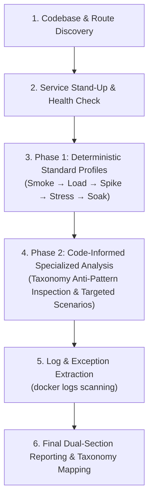

# K6 Load Tester

This skill automates performance quality assurance and active structural flaw debugging for service-based applications using k6 and Docker.

It follows a **deterministic, 2-phase execution strategy**:
1. **Phase 1 (Standard Execution)**: Executes a fixed, deterministic suite of standard load profiles (Smoke, Ramp-Up/Load, Spike, Stress, Soak) against discovered REST/gRPC service endpoints.
2. **Phase 2 (Specialized Code-Informed Flaw Analysis)**: Inspects application source code for specific anti-patterns matching the 16-item taxonomy, constructs targeted ad-hoc load scenarios, and extracts empirical proof of uncovered vulnerabilities.

---

## Standardized Workflow

### 1. Codebase & Route Discovery
- **Spring Boot / Java**: Search for `@RestController`, `@Controller`, `@RequestMapping`, `@GetMapping`, `@PostMapping`, `@PathVariable`, `@RequestParam`, `@RequestBody`. Inspect `application.yml` / `properties` for server port (`server.port`), HikariCP connection pool size (`hikari.maximum-pool-size`), and Tomcat thread pool size (`server.tomcat.threads.max`).
- **Node.js / Python / Go / Rust**: Search for Express `app.get`, FastAPI `@app.get`, Gin/Fiber routes.
- **Auth Setup**: Detect JWT, OAuth2, or session cookies and construct dynamic token generation in `setup()` blocks.

### 2. Service Stand-Up & Health Check
- Stand up target containers via `docker-compose up -d --build` (or `docker build` + `docker run`).
- Verify container health via `curl -s http://localhost:8080/actuator/health` or `docker ps`.

### 3. Phase 1: Deterministic Standard Execution
Always execute the standard suite of 5 load profiles in strict sequence:
1. **Smoke Profile**: 1 VU for 30s to verify baseline endpoint connectivity and health.
2. **Ramp-Up / Load Profile**: 20 VUs sustained for 3m to measure normal peak capacity and baseline throughput.
3. **Spike Profile**: Rapid surge to 100+ VUs in 10s to evaluate queue recovery, check-then-act vulnerabilities, and thread state isolation.
4. **Stress Profile**: Ramping VUs to breaking point (100–200 VUs) to test pool exhaustion limits, row locks, and STW GC freezes.
5. **Soak Profile**: Sustained execution (5–10m) to identify OS socket/file descriptor leaks and slow heap memory growth.

*Record standard metrics (`http_reqs`, `p95` duration, `http_req_failed` %) for all 5 profiles before proceeding.*

### 4. Phase 2: Code-Informed Specialized Flaw Analysis
Inspect application source code for specific architectural anti-patterns from the **16-Item Structural Flaw Taxonomy**:
- **Concurrency & Shared State**: Uncleared `ThreadLocal` variables (`Flaw 1.1`), unsynchronized check-then-act logic (`Flaw 1.2`), missing cache lock coalescing (`Flaw 1.3`), main Event Loop blocking (`Flaw 1.4`).
- **Resource Pool Starvation**: Blocking I/O inside `@Transactional` methods (`Flaw 2.1`), un-timeouted HTTP clients (`Flaw 2.2`), `.parallelStream()` ForkJoinPool blocking (`Flaw 2.3`), single-threaded `@Scheduled` tasks (`Flaw 2.4`).
- **Database & Storage Bottlenecks**: Pessimistic row locking on shared rows (`Flaw 3.1`), non-uniform multi-table locking (`Flaw 3.2`), JPA N+1 lazy loading loops (`Flaw 3.3`).
- **Hardware & OS Exhaustion**: Synchronous file appender logging (`Flaw 4.1`), unpooled sockets or unclosed streams (`Flaw 4.2`).
- **Memory & Runtime**: Unpaginated DB queries (`Flaw 5.1`), static collection memory accumulation (`Flaw 5.2`).
- **Distributed System Failures**: Unbounded memory queues (`Flaw 6.1`), un-backed-off retries (`Flaw 6.2`).

*Generate and execute targeted ad-hoc k6 test scenarios tailored to expose any identified code anti-patterns.*

### 5. Log & Exception Extraction
Extract container logs post-test (`docker logs <container_id>`) to detect silent runtime exceptions (`CannotGetJdbcConnectionException`, `LockTimeoutException`, `ConcurrentModificationException`, `OutOfMemoryError`, `BindException`).

### 6. Final Dual-Section Reporting & Taxonomy Mapping
Produce a structured report containing:
- **Section 1: Standard Load Profile Results**: Matrix of throughput, latency distribution, and error rates across all 5 standard profiles.
- **Section 2: Specialized Code-Informed Flaw Results**: Empirical findings from targeted taxonomy scenarios.
- **Section 3: Flaw Explanation & Taxonomy Mapping**: Code root cause analysis, log evidence, and explicit mapping to taxonomy identifiers (`Flaw 1.1` to `Flaw 6.2`).

---

## Reference Guides

- **Standard Profiles**: See `references/profiles.md` for standard k6 `options` configurations.
- **Taxonomy Verification Guide**: See `references/taxonomy-verification.md` for specialized test strategies covering the 16 taxonomy items.
- **Execution Orchestration**: See `references/workflow.md` for Docker execution, log extraction, and teardown commands.
- **Base Templates**:
  - `assets/k6-base-template.js`: Unauthenticated REST endpoints.
  - `assets/k6-spring-auth-template.js`: Authenticated REST endpoints with setup blocks.
